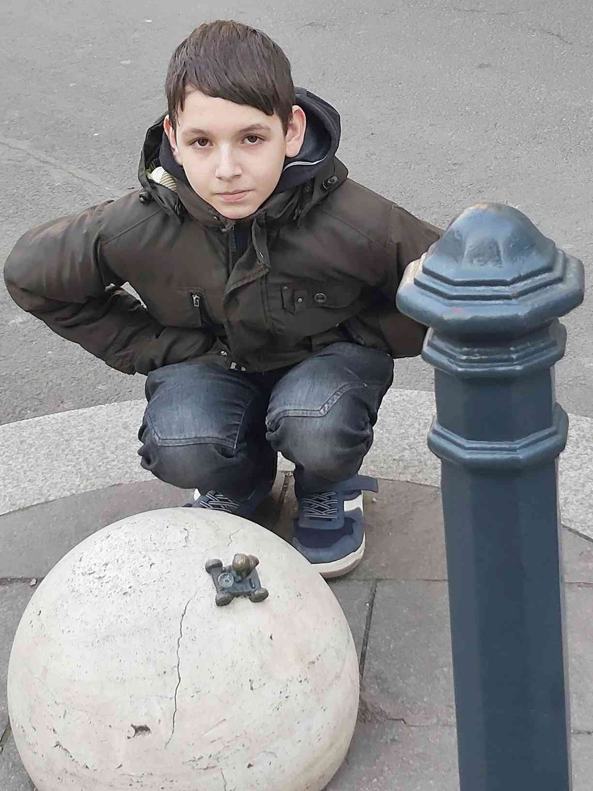
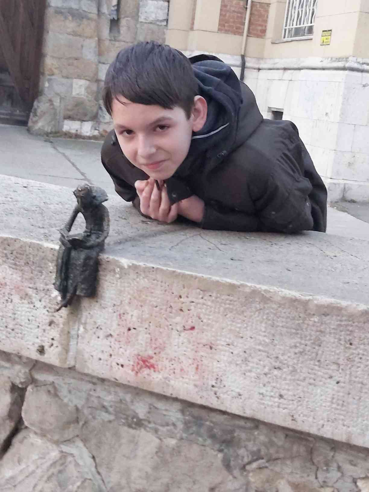
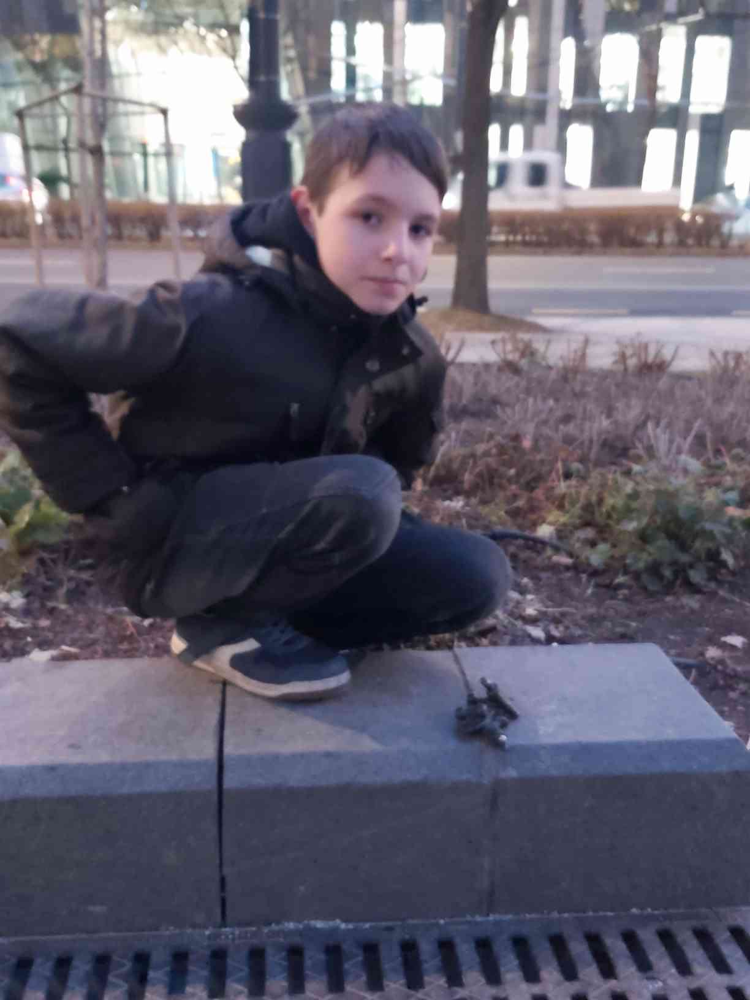
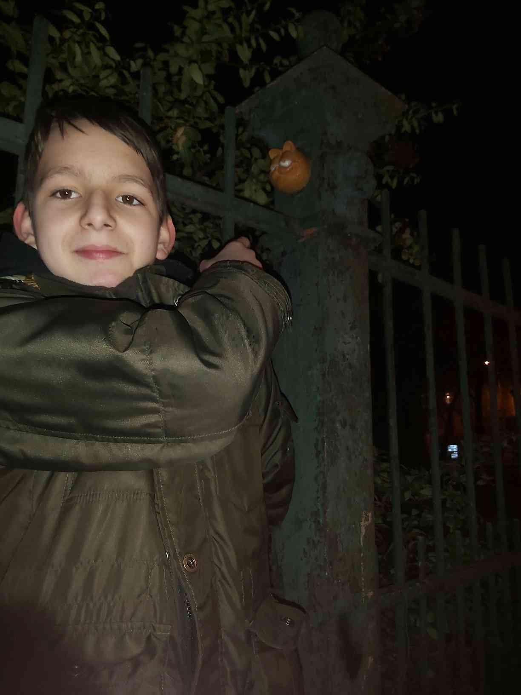

# 1. Holdjáró miniszobor

## Hol van?
Budapest, Hold utca 12, 1054

## Képek

## Rövid leírás

Mihail Kolodko (Kolodkó Mihály) ukrán-magyar szobrászművész, aki apró szobrairől ismert, melyekkel számtalan helyen találkozhatunk a városban.
A Hold utcában, néhány lépésre a Batthyányi-örökmécsestől található Kolodko holdjáró miniszobra. A bronz alkotás egy gömb alakú térelem felületén robog, benne pedig egy integető asztronauta köszönti a járókelőket.
A magyar származású, NASA-díjas amerikai mérnök, Pavlics Ferenc előtt tiszteleg a miniszobor, aki a világon elsőként hozott létre olyan holdjárművet, ami a távoli égitest felszínén is üzemképes maradt.

## Nevezetességek a közelben
1. atthyány Lajos-örökmécses
2. Emléktábla az aradi vértanúkról
---

# 2. Drakula miniszobor

## Hol van?
Budapest, Kós Károly stny. 1, 1146

## Képek

## Rövid leírás

Kolodko Drakula szobránál sokat morfondíroztunk, vajon miért került a Vajdahunyad várához. Már a Kolodko szobor előtt is vaciláltunk, ugyanis van még egy Drakula mellszobor, ami 2003-ban került oda, egyébként nem messze Kolodko Drakulájától. A vacilálásunk oka az, hogy Drakula gróf, azaz az életben Vlad Tepes hírhedt havasalföldi vajda törcsvári. És nem vajdahunyadi. Mindkét város vára Erdélyben található, sőt, a világhírűvé vált Drakula film főszereplője, Drakula gróf is erdélyi, Lugosi Bélának hívták (egyike azon magyaroknak, akik csillagot kaptak a hollywoodi hírességek sétányán). Szóval ez jó, szuper, hogy van egy világhírű sztorink, világhírű színésszel.

Aztán azt is érdemes tudni, hogy a magyarországi Vajdahunyad vára bizony nem az erdélyi Vajdahunyad Várának a másolata. Hanem egy építészzseni, Alpár Ignác műve, aki a történelmi Magyarország legjelentősebb épületeinek formáit (pl. a Hunyadi család Vajdahunyadban található várának részlete, a segesvári Apostol-torony részlete, a jáki és lébényi templom részlete, brassói Katalin bástya részlete, stb.) ötvözte egybe, itt Budapesten, az 1896-os Millenniumra.

## Nevezetességek a közelben
1. Vajdahunyad vára
2. Városliget
---

# 3. Sztálin csizmája miniszobor

## Hol van?
Budapest, Dózsa György út 35, 1146

## Képek

## Rövid leírás

A Néprajzi Múzeum Hősök tere felőli oldalán lévő padkán helyezte el Kolodko Mihály legújabb szobrát, melynek az AMONG US (vagyis a ’Közöttünk’) címet adta. A miniszobor a ledöntött Sztálin-szobor csizmáit ábrázolja (a kilógó csontokkal), és egy gördeszkát. A szobor az Ötvenhatosok terére került, egykor ugyanis itt állt az a Sztálin-szobor, melyből az 1956-os forradalom során történt ledöntése után csak a két csizma maradt ott. Emiatt az egykori Sztálin teret pár napig „Csizma térnek” is hívták. A gördeszka pedig valószínűleg arra utal, hogy a nemrégiben átadott múzeum egy óriási gördeszkapályára hasonlít.

## Nevezetességek a közelben
1. Néprajzi Múzeum
2. Hősök tere
---

# 10. Garfield miniszobor

## Hol van?
Budapest, Dembinszky u. 4-sz. szemben, 1071

## Képek

## Rövid leírás

Kolodko Mihály, akit a főváros közterületein elhelyezett apró alkotásairól ismert meg a város, majd az egész ország, egyébként nem szereti, ha miniszobroknak nevezik a műveit, ő mini emlékműveknek tekinti őket. Bár szakmai berkekben megoszlanak a vélemények a munkáiról (Pólya Zsombor képzőművész például bedobozolta Kolodko Dunakorzón felállított, Roskovics Ignác festőt ábrázoló szobrát), az emberek többsége szereti a város különböző pontjain elhelyezett alkotásokat, és a turisták is rendszeresen fotózkodnak velük. 46 évvel ezelőtt, 1978. június 19-én jelent meg először Jim Davis alkotásában az első, pár képből álló Garfield-képregény az újságokban – a jeles dátum alkalmából Koldoko Mihály szobrászművész pedig most Garfield figuráját dobta fel Budapest VII. kerületének egyik pontjára.

## Nevezetességek a közelben
1. Állatorvostudományi Egyetem
2. Keleti pályaudvar
---

# Nevezetességek a közelben részletesebben:

## Szabadság tér

A Szabadság tér 1846-ban még sétatérként létezett, 1900-tól kapta nevét. 1786 és 1898 között itt állt az Újépület, amely kaszárnya, laktanya és börtön is volt, számos kivégzéssel, köztük Batthyány Lajos miniszterelnökével. Az épület bontása után kapta a tér a Szabadság tér nevet. A tér alatt a Rákosi-bunker található, valamint mélygarázs és interaktív szökőkút is. Ma park és játszótér díszíti, népszerű pihenőhely.

## Országház

Az Országház Budapest egyik legismertebb épülete, a magyar parlament székhelye. 1885 és 1904 között épült Steindl Imre tervei alapján, neogótikus stílusban. Az épület impozáns homlokzata és a kupola kiemelkedő jellemzői. A parlamenti ülések helyszínéül szolgál, de látogatók számára is nyitva áll, és a magyar államiság szimbóluma. Az Országház az UNESCO Világörökség része, és számos jelentős történelmi esemény színhelye volt.

## Kossuth Lajos tér

A Kossuth Lajos tér Budapest szívében található, és fontos politikai és történelmi szerepet játszik. Itt helyezkedik el az Országház, valamint a tér körül számos jelentős épület, mint a Kossuth-emlékmű és a Vértanúk emléke. A tér a magyar történelem fontos eseményeinek színhelye, többek között a 1848-as forradalom idején. A közelmúltban átfogó felújításon esett át, modern parkosítással és sétálóterületekkel, így a tér ma a pihenés és a politikai események központja.

## Hősök tere

A Hősök tere Budapest egyik legnagyobb és legismertebb tere, mely a város központjában található, a Városliget bejáratánál. A tér közepén álló Millenniumi Emlékmű a magyar történelem kiemelkedő alakjait ábrázolja, köztük a honfoglaló vezéreket és más fontos személyeket. Az emlékmű mellett két nagy oszlopon elhelyezett szobrok is láthatók. A Hősök tere a magyar nemzeti ünnepek, valamint egyéb rendezvények helyszíne, és a világörökség része.

## Városliget

A Hősök tere Budapest egyik legismertebb és legnagyobb tere, a Városliget bejáratánál. Az 1896-os millenniumi ünnepség alkalmából alakították ki. Központjában a Millenniumi Emlékmű áll, amely a magyar történelem fontos alakjait ábrázolja, többek között a honfoglaló vezéreket. A tér két oldalán található a Műcsarnok és a Szépművészeti Múzeum. A Hősök tere nemcsak a nemzeti ünnepek helyszíne, hanem a város egyik jelentős turisztikai látványossága is.

## Keleti pályaudvar

A Keleti Pályaudvar Budapest egyik legforgalmasabb vasútállomása, amely 1884-ben nyílt meg. Az épület neogótikus stílusban készült, és impozáns üvegtetője, valamint díszes homlokzata figyelemre méltó. A pályaudvar nemcsak fontos közlekedési csomópont, hanem a város egyik szimbóluma is. A Keleti Pályaudvar a nemzetközi és belföldi vonatok induló és érkező helyszíne, és a város közlekedésének egyik meghatározó eleme.

---
# FORRÁSOK

https://www.errearra.org/kolodko-holdjaro

https://www.errearra.org/kolodko-drakula

https://welovebudapest.com/cikk/2022/10/23/latnivalok-es-kultura-uj-kolodko-szobor-neprajzi-muzeum-mellett-sztalin-csizma-1956/

https://www.errearra.org/kolodko-garfield